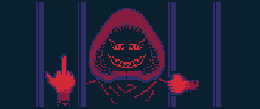

= (WIP) guerrilla — A collection of easy-to-deploy censorship circumvention tools for digital guerrillas
de4thr0ll <github.com/de4thr0ll>
:toc:
:icons: font

This repository provides a Docker Compose project for running different kinds of proxies and other censorship circumvention tools on your own servers.
More services and documentation will be added later.

The announcement can be found link:https://dev.to/deathroll/guerrilla-your-personal-censorship-circumvention-toolbox-bpe[here].



== Roadmap
This project is in its early stages of development.
The roadmap will be updated as new needs arise.

- [x] (service) shadowsocks server
- [ ] (service) DNS resolver and/or proxy with support for DoH
- [ ] (service) mask as a regular site
- [x] (tool) shadowsocks qr generator
- [x] (tool) openssl base64 password generator

== Usage

. Clone the project
+
```console
$ git clone https://github.com/de4thr0ll/guerrilla.git
```
+
NOTE: All further commands are performed in the cloned project root directory.

. Build and pull all container images
+
```console
$ docker compose pull && docker compose build
```
+
NOTE: This may take quite some time, especially for the tools image.

. Add a `.env` file with the following contents
+
```
EXTERNAL_IP=<your.server_ip.without.angles>
```

. Follow further instructions for a specific service or tool.

== Services
=== shadowsocks-rust server
A port of link:https://shadowsocks.org/[shadowsocks] written in Rust. For more, see link:https://github.com/shadowsocks/shadowsocks-rust[this repo].

. Generate a password for the server
+
TIP: See link:#genpass[genpass].

. Create a configuration file
+
```console
$ cp shadowsocks.json{.example,}
```

. Edit the configuration file `shadowsocks.json` as appropriate
+
--
TIP: The config file reference can be found link:https://github.com/shadowsocks/shadowsocks/wiki/Configuration-via-Config-File[here].

WARNING: If you want to change the port shadowsocks-rust is listening on, don't forget to change it in the `compose.yml` file.

NOTE: The `server` field in the config file must contain the service name, `shadowsocks`.
--

. Start the server
+
```console
$ docker compose up -d shadowsocks
```

== Tools
Miscellaneous tools to simplify your user experience.

=== genqr — Generate a QR code for shadowsocks clients
This will generate a QR code for adding shadowsocks configuration to clients.
The code will be printed right in your terminal in UTF-8.

link:img/qrexample.mp4[Example video]

```console
$ docker compose run --rm tools genqr
```

[#genpass]
=== genpass — Generate a random password using openssl
```console
$ docker compose run --rm tools genpass <size>
```

NOTE: `<size>` is the size of your password in bytes. The password itself will have a larger count of characters since it is encoded in Base64.

TIP: The longer password the better. Make sure to use at least 20-byte passwords.

== Licenses
* The code is licensed under the link:LICENSE[BSD Zero Clause License].

* link:img/guerrilla-banner-512x215.png[guerrilla banner] © 2024 by de4thr0ll <github.com/de4thr0ll> is licensed under CC BY 4.0.
